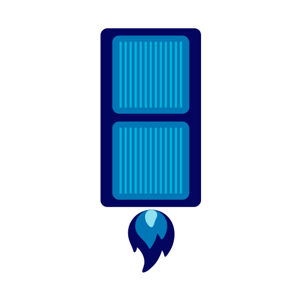

#  Mushak

**Zero-Config, Zero-Downtime deployments to your Linux server**

Mushak is a CLI tool that brings PaaS-like deployment experience to your own Linux VPS. Deploy your Docker-based applications with a simple `git push`, complete with automatic builds, health checks, and zero-downtime switching.

## Why Mushak?

I absolutly love Docker and Docker Compose. But it has 2 big issues:

1. You need script or some kind of automation to get docker compose up and running on a remote server and then configure env. etc. 
2. You will face downtime with when redeployen a new version of your app. 

These 2 isses is why Mushak exists. It is a zero-config, zero-downtime alternative to self hosted PaaS you find on the market. 

So its basically GIT + Caddy + Docker (Compose) = Mushak.

## Features

- **Zero Configuration**: Works out-of-the-box with `Dockerfile` or `docker-compose.yml`
- **Zero Downtime**: Uses Caddy reverse proxy for atomic traffic switching
- **Multi-App Support**: Deploy multiple apps on the same server
- **Smart Builds**: Automatically detects and handles both Dockerfile and Docker Compose projects
- **Health Checks**: Ensures new deployments are healthy before switching traffic
- **Automatic Cleanup**: Manages old containers and deployment artifacts
- **Branch Control**: Configure which Git branch triggers deployments
- **Self-Updating**: Built-in update mechanism

## Prerequisites

- **Local Machine**: Git installed
- **Server**: Fresh Linux server (Ubuntu strongly recommended) with SSH access
- **Domain**: DNS pointing to your server (for HTTPS via Caddy)
- **Project**: Application with `Dockerfile` or `docker-compose.yml`

## Installation

### macOS (Homebrew)

```bash
# Coming soon
brew install mushak
```

### From Source

```bash
git clone https://github.com/hmontazeri/mushak.git
cd mushak
go build -o mushak ./cmd/mushak
sudo mv mushak /usr/local/bin/
```

### Binary Download

Download the latest binary from [GitHub Releases](https://github.com/hmontazeri/mushak/releases)

## Quick Start

### 1. Initialize

In your project directory:

```bash
mushak init \
  --host user@your-server.com \
  --domain app.example.com \
  --app myapp \
  --branch main
```

This will:
- Install Docker, Git, and Caddy on your server
- Set up a Git repository
- Configure deployment hooks
- Add a Git remote named `mushak`

### 2. Deploy

```bash
mushak deploy
```

Your app will be built, health-checked, and deployed with zero downtime!

### 3. Access Your App

Visit `https://app.example.com` (make sure DNS is configured)

## How It Works

1. **Git Push**: `mushak deploy` pushes your code to the server's bare Git repository
2. **Hook Triggered**: A post-receive hook on the server starts the deployment process
3. **Build**: Detects Dockerfile or docker-compose.yml and builds your app
4. **Port Assignment**: Finds a free port (8000-9000) for the new container
5. **Health Check**: Polls the health endpoint (default: `/`) for up to 30 seconds
6. **Traffic Switch**: Updates Caddy configuration to point to the new container
7. **Cleanup**: Stops and removes old containers

## Configuration

### Optional `mushak.yaml` in Your Project

```yaml
# Port your app listens on inside the container
internal_port: 3000

# Health check endpoint
health_path: /api/health

# Health check timeout in seconds
health_timeout: 60
```

## Commands

### `mushak init`

Initialize a new app on the server.

```bash
mushak init --host user@server.com --domain app.com --app myapp --branch main
```

**Flags:**
- `--host`: Server address (user@hostname)
- `--domain`: Domain name for the app (required)
- `--app`: App name (default: current directory name)
- `--branch`: Git branch to deploy (default: main)
- `--key`: SSH key path (default: ~/.ssh/id_rsa)
- `--port`: SSH port (default: 22)

### `mushak deploy`

Deploy the current branch to the server.

```bash
mushak deploy
```

**Flags:**
- `-f, --force`: Force push to server

### `mushak destroy`

Remove an app from the server.

```bash
mushak destroy
```

**Flags:**
- `--host`: Server address (optional if config exists)
- `--user`: SSH username (optional if config exists)
- `--app`: App name (optional if config exists)
- `--force`: Skip confirmation prompt

### `mushak update`

Update mushak to the latest version.

```bash
mushak update
```

**Flags:**
- `--check`: Check for updates without installing

### `mushak version`

Show the current version.

```bash
mushak version
```

### `mushak logs`

Stream logs from your application.

```bash
mushak logs
```

**Flags:**
- `-f, --follow`: Follow log output
- `-n, --lines`: Number of lines to show (default: 100)

### `mushak exec`

Open an interactive shell in your application container.

```bash
mushak exec
```

### `mushak env set`

Securely set environment variables for your application.

Mushak manages environment variables with the following priority:
1. First checks for `.env.prod` on the server
2. Falls back to `.env` if `.env.prod` doesn't exist
3. Creates `.env.prod` by default if neither exists
4. During deployment, copies the environment file to each release

```bash
mushak env set DATABASE_PASSWORD=secret RAILS_MASTER_KEY=abc123
```


## Examples

### Node.js App with Dockerfile

```dockerfile
FROM node:18-alpine
WORKDIR /app
COPY package*.json ./
RUN npm install
COPY . .
EXPOSE 3000
CMD ["npm", "start"]
```

```yaml
# mushak.yaml
internal_port: 3000
health_path: /health
```

### Python App with Docker Compose

```yaml
# docker-compose.yml
version: '3'
services:
  web:
    build: .
    # Don't specify ports here - mushak handles this
    environment:
      - DATABASE_URL=postgresql://...
```

```yaml
# mushak.yaml
internal_port: 8000
health_path: /api/health
```

## Multi-App Deployment

Deploy multiple apps on the same server:

```bash
# App 1
cd ~/projects/app1
mushak init --host user@server.com --domain app1.com --app app1

# App 2
cd ~/projects/app2
mushak init --host user@server.com --domain app2.com --app app2
```

Each app gets its own:
- Git repository
- Deployment directory
- Caddy configuration
- Port assignment

## Server Structure

```
/var/repo/
  ├── app1.git/          # Bare Git repo
  ├── app2.git/

/var/www/
  ├── app1/
  │   ├── abc123/        # Deployment by commit SHA
  │   └── def456/
  ├── app2/

/etc/caddy/
  ├── Caddyfile          # Main config (imports apps)
  └── apps/
      ├── app1.caddy     # Per-app reverse proxy config
      └── app2.caddy
```

## Troubleshooting

### Deployment Failed

Check the output from `mushak deploy`. Common issues:
- Health check timeout (increase in `mushak.yaml`)
- Port already in use (mushak will find another)
- Build errors (fix Dockerfile/docker-compose.yml)

### SSH Connection Failed

- Verify SSH access: `ssh user@server.com`
- Check SSH key path: `--key ~/.ssh/id_rsa`
- Ensure server allows SSH connections

### Domain Not Working

- Verify DNS points to your server: `dig app.example.com`
- Check Caddy is running: `ssh user@server.com sudo systemctl status caddy`
- View Caddy logs: `ssh user@server.com sudo journalctl -u caddy -f`

## Security Considerations

- Uses SSH key-based authentication
- Server requires passwordless sudo for Docker and Caddy operations
- HTTPS automatically configured by Caddy
- Containers run in isolated Docker networks

## Roadmap

- [ ] GitHub Actions integration
- [ ] Rollback to previous deployment
- [x] Log viewing (`mushak logs`)
- [x] SSH access (`mushak exec`)
- [x] Environment variable management (`mushak env set`)
- [ ] Database migrations support
- [ ] Custom health check commands

## Contributing

Contributions are welcome! Please open an issue or submit a pull request.

## License

MIT License - see LICENSE file for details

## Credits

Built with:
- [Cobra](https://github.com/spf13/cobra) - CLI framework
- [Caddy](https://caddyserver.com/) - Reverse proxy
- [Docker](https://www.docker.com/) - Containerization
- [go-github-selfupdate](https://github.com/rhysd/go-github-selfupdate) - Self-update

## Support

- GitHub Issues: [github.com/hmontazeri/mushak/issues](https://github.com/hmontazeri/mushak/issues)
- Documentation: [github.com/hmontazeri/mushak/wiki](https://github.com/hmontazeri/mushak/wiki)
